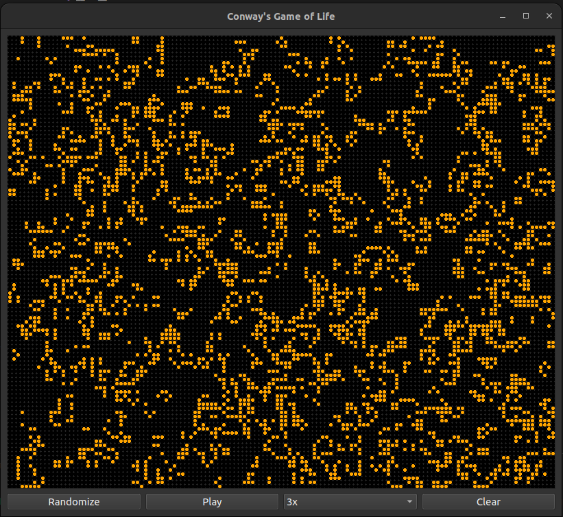

# Conway's Game of Life
A light GUI for the game of life implemented using Python and PyQt6.

To run the code, download the files and run "main.py". The randomize button will randomly add and destroy cells. The clear button will clear the board of any cells. You can also modify the playback speed to make the simulation faster or slower. The play/pause button is used for pausing/playing the simulation. 
